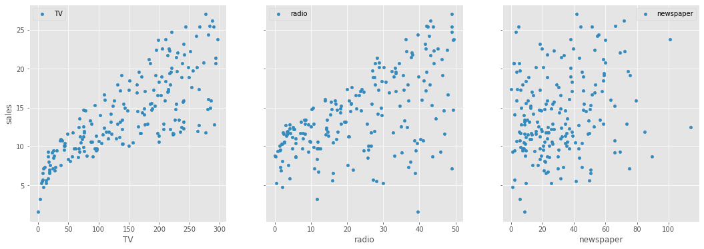
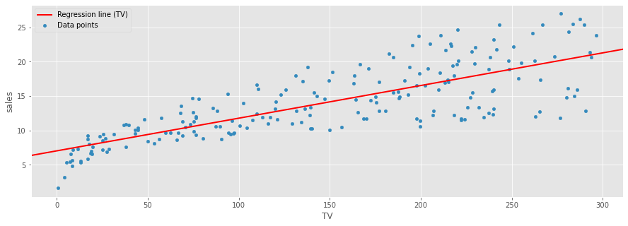
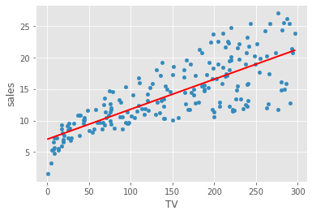
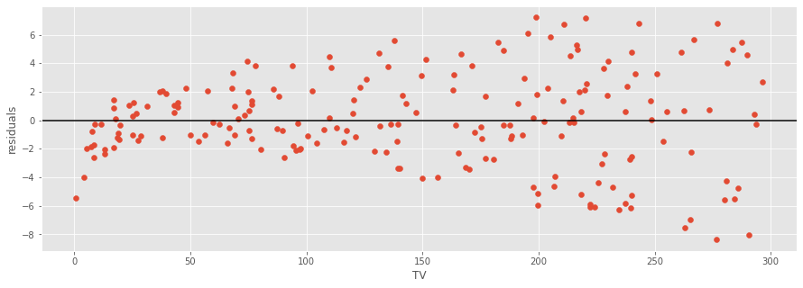
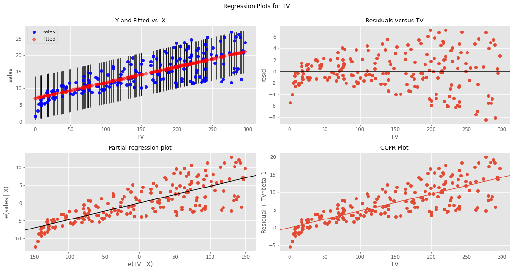
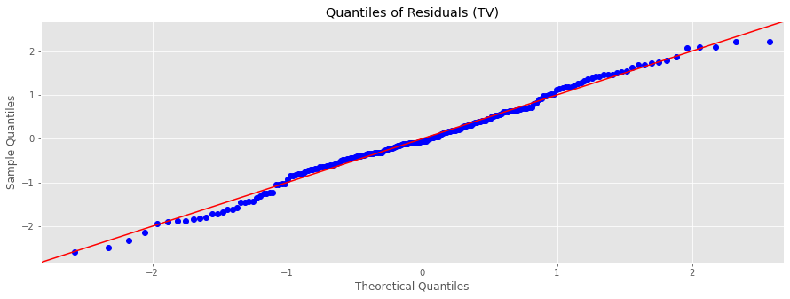

# Linear Regression in StatsModels - Lab

## Introduction

It's time to apply the StatsModels skills from the previous lesson! In this lab , you'll explore a slightly more complex example to study the impact of spending on different advertising channels on total sales.

## Objectives

You will be able to:

* Perform a linear regression using StatsModels
* Evaluate a linear regression model using StatsModels
* Interpret linear regression coefficients using StatsModels

## Let's Get Started

In this lab, you'll work with the "Advertising Dataset", which is a very popular dataset for studying simple regression. [The dataset is available on Kaggle](https://www.kaggle.com/purbar/advertising-data), but we have downloaded it for you. It is available in this repository as `advertising.csv`. You'll use this dataset to answer this question:

> Which advertising channel has the strongest relationship with sales volume, and can be used to model and predict the sales?

The columns in this dataset are:

1. `sales`: the number of widgets sold (in thousands)
2. `tv`: the amount of money (in thousands of dollars) spent on TV ads
3. `radio`: the amount of money (in thousands of dollars) spent on radio ads
4. `newspaper`: the amount of money (in thousands of dollars) spent on newspaper ads

## Step 1: Exploratory Data Analysis


```python
# Load necessary libraries and import the data

```


```python
# __SOLUTION__ 
# Load necessary libraries and import the data
import pandas as pd
import matplotlib.pyplot as plt
plt.style.use('ggplot')
data = pd.read_csv('advertising.csv', index_col=0)
```


```python
# Check the columns and first few rows

```


```python
# __SOLUTION__ 
# Check the columns and first few rows
data.head()
```


<div>
<style scoped>
    .dataframe tbody tr th:only-of-type {
        vertical-align: middle;
    }

    .dataframe tbody tr th {
        vertical-align: top;
    }

    .dataframe thead th {
        text-align: right;
    }
</style>
<table border="1" class="dataframe">
  <thead>
    <tr style="text-align: right;">
      <th></th>
      <th>TV</th>
      <th>radio</th>
      <th>newspaper</th>
      <th>sales</th>
    </tr>
  </thead>
  <tbody>
    <tr>
      <th>1</th>
      <td>230.1</td>
      <td>37.8</td>
      <td>69.2</td>
      <td>22.1</td>
    </tr>
    <tr>
      <th>2</th>
      <td>44.5</td>
      <td>39.3</td>
      <td>45.1</td>
      <td>10.4</td>
    </tr>
    <tr>
      <th>3</th>
      <td>17.2</td>
      <td>45.9</td>
      <td>69.3</td>
      <td>9.3</td>
    </tr>
    <tr>
      <th>4</th>
      <td>151.5</td>
      <td>41.3</td>
      <td>58.5</td>
      <td>18.5</td>
    </tr>
    <tr>
      <th>5</th>
      <td>180.8</td>
      <td>10.8</td>
      <td>58.4</td>
      <td>12.9</td>
    </tr>
  </tbody>
</table>
</div>


```python
# Generate summary statistics for data with .describe()

```


```python
# __SOLUTION__ 
# Generate summary statistics for data with .describe()
data.describe()
```


<div>
<style scoped>
    .dataframe tbody tr th:only-of-type {
        vertical-align: middle;
    }

    .dataframe tbody tr th {
        vertical-align: top;
    }

    .dataframe thead th {
        text-align: right;
    }
</style>
<table border="1" class="dataframe">
  <thead>
    <tr style="text-align: right;">
      <th></th>
      <th>TV</th>
      <th>radio</th>
      <th>newspaper</th>
      <th>sales</th>
    </tr>
  </thead>
  <tbody>
    <tr>
      <th>count</th>
      <td>200.000000</td>
      <td>200.000000</td>
      <td>200.000000</td>
      <td>200.000000</td>
    </tr>
    <tr>
      <th>mean</th>
      <td>147.042500</td>
      <td>23.264000</td>
      <td>30.554000</td>
      <td>14.022500</td>
    </tr>
    <tr>
      <th>std</th>
      <td>85.854236</td>
      <td>14.846809</td>
      <td>21.778621</td>
      <td>5.217457</td>
    </tr>
    <tr>
      <th>min</th>
      <td>0.700000</td>
      <td>0.000000</td>
      <td>0.300000</td>
      <td>1.600000</td>
    </tr>
    <tr>
      <th>25%</th>
      <td>74.375000</td>
      <td>9.975000</td>
      <td>12.750000</td>
      <td>10.375000</td>
    </tr>
    <tr>
      <th>50%</th>
      <td>149.750000</td>
      <td>22.900000</td>
      <td>25.750000</td>
      <td>12.900000</td>
    </tr>
    <tr>
      <th>75%</th>
      <td>218.825000</td>
      <td>36.525000</td>
      <td>45.100000</td>
      <td>17.400000</td>
    </tr>
    <tr>
      <th>max</th>
      <td>296.400000</td>
      <td>49.600000</td>
      <td>114.000000</td>
      <td>27.000000</td>
    </tr>
  </tbody>
</table>
</div>


Based on what you have seen so far, describe the contents of this dataset. Remember that our business problem is asking us to build a model that predicts sales.


```python
# Your answer here
```

<details>
    <summary style="cursor: pointer"><b>Answer (click to reveal)</b></summary>

Every record in our dataset shows the advertising budget spend on TV, newspaper, and radio campaigns as well as a target variable, sales.

The count for each is 200, which means that we do not have any missing data.

Looking at the mean values, it appears that spending on TV is highest, and spending on radio is lowest. This aligns with what we see in the output from `head()`.
    
</details>

Now, use scatter plots to plot each predictor (TV, radio, newspaper) against the target variable.


```python
# Visualize the relationship between the preditors and the target using scatter plots

```


```python
# __SOLUTION__ 
# Visualize the relationship between the preditors and the target using scatter plots
fig, axs = plt.subplots(1, 3, sharey=True, figsize=(18, 6))
for idx, channel in enumerate(['TV', 'radio', 'newspaper']):
    data.plot(kind='scatter', x=channel, y='sales', ax=axs[idx], label=channel)
    axs[idx].legend()
```


    

    


Does there appear to be a linear relationship between these predictors and the target?


```python
# Record your observations on linearity here 
```

<details>
    <summary style="cursor: pointer"><b>Answer (click to reveal)</b></summary>

`TV` seems to be a good predictor because it has the most linear relationship with sales.

`radio` also seems to have a linear relationship, but there is more variance than with `TV`. We would expect a model using `radio` to be able to predict the target, but not as well as a model using `TV`.

`newspaper` has the least linear-looking relationship. There is a lot of variance as well. It's not clear from this plot whether a model using `newspaper` would be able to predict the target.
    
</details>

## Step 2: Run a Simple Linear Regression with `TV` as the Predictor

As the analysis above indicates, `TV` looks like it has the strongest relationship with `sales`. Let's attempt to quantify that using linear regression.


```python
# Import libraries

# Determine X and y values

# Create an OLS model

```


```python
# __SOLUTION__ 
# Import libraries
import statsmodels.api as sm

# Determine X and y values
X = data[["TV"]]
y = data["sales"]

# Create an OLS model
model = sm.OLS(endog=y, exog=sm.add_constant(X))
```


```python
# Get model results

# Display results summary

```


```python
# __SOLUTION__
# Get model results
results = model.fit()

# Display results summary
print(results.summary())
```

                                OLS Regression Results                            
    ==============================================================================
    Dep. Variable:                  sales   R-squared:                       0.612
    Model:                            OLS   Adj. R-squared:                  0.610
    Method:                 Least Squares   F-statistic:                     312.1
    Date:                Fri, 06 May 2022   Prob (F-statistic):           1.47e-42
    Time:                        18:09:18   Log-Likelihood:                -519.05
    No. Observations:                 200   AIC:                             1042.
    Df Residuals:                     198   BIC:                             1049.
    Df Model:                           1                                         
    Covariance Type:            nonrobust                                         
    ==============================================================================
                     coef    std err          t      P>|t|      [0.025      0.975]
    ------------------------------------------------------------------------------
    const          7.0326      0.458     15.360      0.000       6.130       7.935
    TV             0.0475      0.003     17.668      0.000       0.042       0.053
    ==============================================================================
    Omnibus:                        0.531   Durbin-Watson:                   1.935
    Prob(Omnibus):                  0.767   Jarque-Bera (JB):                0.669
    Skew:                          -0.089   Prob(JB):                        0.716
    Kurtosis:                       2.779   Cond. No.                         338.
    ==============================================================================
    
    Notes:
    [1] Standard Errors assume that the covariance matrix of the errors is correctly specified.


## Step 3: Evaluate and Interpret Results from Step 2

How does this model perform overall? What do the coefficients say about the relationship between the variables?


```python
# Your answer here
```

<details>
    <summary style="cursor: pointer"><b>Answer (click to reveal)</b></summary>

Overall the model and coefficients are **statistically significant**, with all p-values well below a standard alpha of 0.05.

The R-squared value is about 0.61 i.e. **61% of the variance in the target variable can be explained by TV spending**.

The intercept is about 7.0, meaning that if we spent 0 on TV, we would expect sales of about 7k widgets (the units of `sales` are in thousands of widgets).

The `TV` coefficient is about 0.05, meaning that **for each additional &dollar;1k spent on TV (the units of `TV` are in thousands of dollars), we would expect to sell an additional 50 widgets**. (More precisely, 47.5 widgets.)

Note that all of these coefficients represent associations rather than causation. It's possible that better sales are what leads to more TV spending! Either way, `TV` seems to have a strong relationship with `sales`.

</details>

## Step 4: Visualize Model with `TV` as Predictor

Create at least one visualization that shows the prediction line against a scatter plot of `TV` vs. sales, as well as at least one visualization that shows the residuals.


```python
# Plot the model fit (scatter plot and regression line)

```


```python
# __SOLUTION__
# abline_plot version of model fit
fig, ax = plt.subplots(figsize=(15,5))
data.plot(x="TV", y="sales", kind="scatter", label="Data points", ax=ax)
sm.graphics.abline_plot(model_results=results, label="Regression line (TV)", c="red", linewidth=2, ax=ax)
ax.legend()
plt.show()
```


    

    


```python
# __SOLUTION__
# plot_fit version of model fit
fig, ax = plt.subplots(figsize=(15,5))
sm.graphics.plot_fit(results, "TV", ax=ax)
plt.show()
```


    

    


```python
# Plot the model residuals

```


```python
# __SOLUTION__
# Plotting residuals vs. TV

fig, ax = plt.subplots(figsize=(15,5))

ax.scatter(data["TV"], results.resid)
ax.axhline(y=0, color="black")

ax.set_xlabel("TV")
ax.set_ylabel("residuals");
```


    

    


```python
# __SOLUTION__
# Plotting residual histogram
fig, ax = plt.subplots(figsize=(15,5))

ax.hist(results.resid)
ax.set_title("Distribution of Residuals (TV)");
```


    

    


```python
# __SOLUTION__
# Plotting residual Q-Q plot
from scipy.stats import norm
fig, ax = plt.subplots(figsize=(15,5))
sm.graphics.qqplot(results.resid, dist=norm, line="45", fit=True, ax=ax)
ax.set_title("Quantiles of Residuals (TV)")
plt.show()
```


    

    


## Step 5: Repeat Steps 2-4 with `radio` as Predictor

Compare and contrast the model performance, coefficient value, etc. The goal is to answer the business question described above.


```python
# Run model

# Display results

```


```python
# __SOLUTION__
# Run model
X_radio = data[["radio"]]
model_radio = sm.OLS(endog=y, exog=sm.add_constant(X_radio))

# Display results
results_radio = model_radio.fit()
print(results_radio.summary())
```

                                OLS Regression Results                            
    ==============================================================================
    Dep. Variable:                  sales   R-squared:                       0.332
    Model:                            OLS   Adj. R-squared:                  0.329
    Method:                 Least Squares   F-statistic:                     98.42
    Date:                Fri, 06 May 2022   Prob (F-statistic):           4.35e-19
    Time:                        18:09:37   Log-Likelihood:                -573.34
    No. Observations:                 200   AIC:                             1151.
    Df Residuals:                     198   BIC:                             1157.
    Df Model:                           1                                         
    Covariance Type:            nonrobust                                         
    ==============================================================================
                     coef    std err          t      P>|t|      [0.025      0.975]
    ------------------------------------------------------------------------------
    const          9.3116      0.563     16.542      0.000       8.202      10.422
    radio          0.2025      0.020      9.921      0.000       0.162       0.243
    ==============================================================================
    Omnibus:                       19.358   Durbin-Watson:                   1.946
    Prob(Omnibus):                  0.000   Jarque-Bera (JB):               21.910
    Skew:                          -0.764   Prob(JB):                     1.75e-05
    Kurtosis:                       3.544   Cond. No.                         51.4
    ==============================================================================
    
    Notes:
    [1] Standard Errors assume that the covariance matrix of the errors is correctly specified.


```python
# Visualize model fit

```


```python
# __SOLUTION__
# Visualize model fit
fig, ax = plt.subplots(figsize=(15,5))
data.plot(x="radio", y="sales", kind="scatter", label="Data points", ax=ax)
sm.graphics.abline_plot(model_results=results_radio, label="Regression line (radio)", c="red", linewidth=2, ax=ax)
ax.legend()
plt.show()
```


    

    


```python
# Visualize residuals

```


```python
# __SOLUTION__
# Visualize residuals
fig, ax = plt.subplots(figsize=(15,5))

ax.scatter(data["radio"], results_radio.resid)
ax.axhline(y=0, color="black")

ax.set_xlabel("radio")
ax.set_ylabel("residuals");
```


    

    


```python
# Your interpretation here
```

<details>
    <summary style="cursor: pointer"><b>Answer (click to reveal)</b></summary>

Same as with `TV`, the model using `radio` to predict `sales` as well as its parameters are **statistically significant** (p-values well below 0.05).

However, this model explains less of the variance. It only **explains about 33% of the variance in `sales`**, compared to about 61% explained by `TV`. If our main focus is the percentage of variance explained, this is a worse model than the `TV` model.

On the other hand, the coefficient for `radio` is much higher. **An increase of &dollar;1k in radio spending is associated with an increase of sales of about 200 widgets!** This is roughly 4x the increase of widget sales that we see for `TV`.

Visualizing this model, it doesn't look much different from the `TV` model.
    
So, how should we answer the business question? Realistically, you would need to return to your stakeholders to get a better understanding of what they are looking for. Do they care more about the variable that explains more variance, or do they care more about where an extra &dollar;1k of advertising spending is likely to make the most difference?

</details>

## Step 6: Repeat Steps 2-4 with `newspaper` as Predictor

Once again, use this information to compare and contrast.


```python
# Run model

# Display results

```


```python
# __SOLUTION__
# Run model
X_newspaper = data[["newspaper"]]
model_newspaper = sm.OLS(endog=y, exog=sm.add_constant(X_newspaper))

# Display results
results_newspaper = model_newspaper.fit()
print(results_newspaper.summary())
```

                                OLS Regression Results                            
    ==============================================================================
    Dep. Variable:                  sales   R-squared:                       0.052
    Model:                            OLS   Adj. R-squared:                  0.047
    Method:                 Least Squares   F-statistic:                     10.89
    Date:                Fri, 06 May 2022   Prob (F-statistic):            0.00115
    Time:                        18:09:43   Log-Likelihood:                -608.34
    No. Observations:                 200   AIC:                             1221.
    Df Residuals:                     198   BIC:                             1227.
    Df Model:                           1                                         
    Covariance Type:            nonrobust                                         
    ==============================================================================
                     coef    std err          t      P>|t|      [0.025      0.975]
    ------------------------------------------------------------------------------
    const         12.3514      0.621     19.876      0.000      11.126      13.577
    newspaper      0.0547      0.017      3.300      0.001       0.022       0.087
    ==============================================================================
    Omnibus:                        6.231   Durbin-Watson:                   1.983
    Prob(Omnibus):                  0.044   Jarque-Bera (JB):                5.483
    Skew:                           0.330   Prob(JB):                       0.0645
    Kurtosis:                       2.527   Cond. No.                         64.7
    ==============================================================================
    
    Notes:
    [1] Standard Errors assume that the covariance matrix of the errors is correctly specified.


```python
# Visualize model fit

```


```python
# __SOLUTION__
# Visualize model fit
fig, ax = plt.subplots(figsize=(15,5))
data.plot(x="newspaper", y="sales", kind="scatter", label="Data points", ax=ax)
sm.graphics.abline_plot(model_results=results_newspaper, label="Regression line (newspaper)", c="red", linewidth=2, ax=ax)
ax.legend()
plt.show()
```


    

    


```python
# Visualize residuals

```


```python
# __SOLUTION__
# Visualize residuals
fig, ax = plt.subplots(figsize=(15,5))

ax.scatter(data["newspaper"], results_newspaper.resid)
ax.axhline(y=0, color="black")

ax.set_xlabel("newspaper")
ax.set_ylabel("residuals");
```


    

    


```python
# Your interpretation here
```

<details>
    <summary style="cursor: pointer"><b>Answer (click to reveal)</b></summary>

Technically our model and coefficients are **still statistically significant** at an alpha of 0.05, but the p-values are much higher. For both the F-statistic (overall model significance) and the `newspaper` coefficient, our p-values are about 0.001, meaning that there is about a 0.1% chance that a variable with _no linear relationship_ would produce these statistics. That is a pretty small false positive rate, so we'll consider the model to be statistically significant and move on to interpreting the other results.

The R-Squared here is the smallest we have seen yet: 0.05. This means that **the model explains about 5% of the variance in `sales`**. 5% is well below both the `radio` model (33%) and the `TV` model (61%).

The coefficient is also small, though similar to the `TV` coefficient. **An increase of &dollar;1k in newspaper spending is associated with about 50 additional widget sales** (more precisely, about 54.7). This is still much less than the 200-widget increase associated with &dollar;1k of additional `radio` spending.

Visualizing this model, the best-fit line is clearly not a strong predictor. On the other hand, the residuals exhibit _homoscedasticity_, meaning that the distribution of the residuals doesn't vary much based on the value of `newspaper`. This contrasts with the `radio` and `TV` residuals which exhibit a "cone" shape, where the errors are larger as the x-axis increases. Homoscedasticity of residuals is a good thing, which we will describe more in depth when we discuss regression assumptions.

Once again, how should we answer the business question? Regardless of the framing, it is unlikely that `newspaper` is the answer that your stakeholders want. This model has neither the highest R-Squared nor the highest coefficient.

</details>

## Summary

In this lab, you ran a complete regression analysis with a simple dataset. You used StatsModels to perform linear regression and evaluated your models using statistical metrics as well as visualizations. You also reached a conclusion about how you would answer a business question using linear regression.
