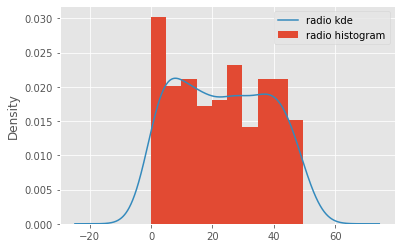
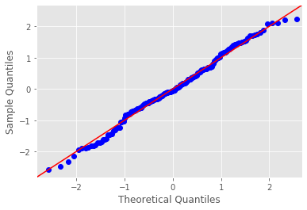
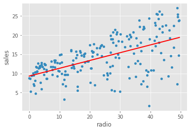
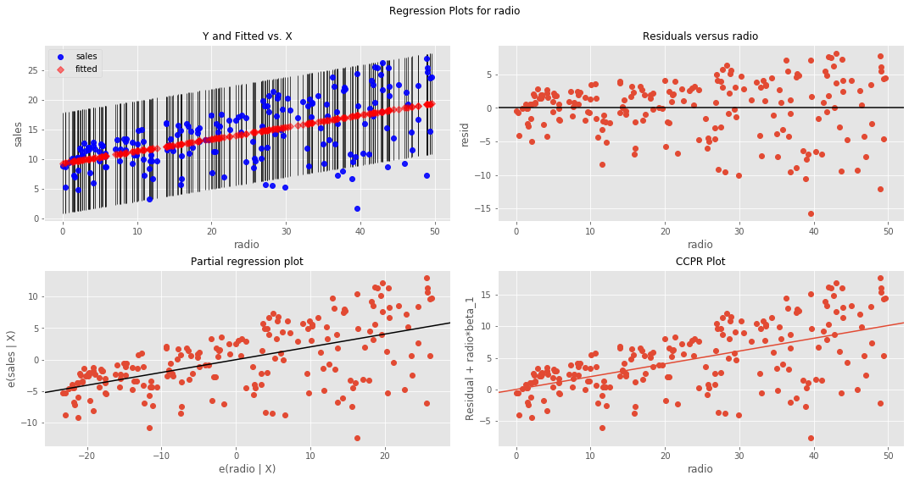
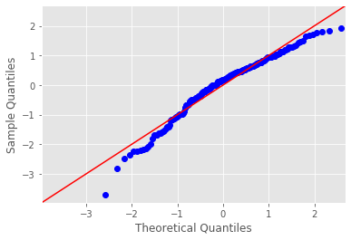

# Ordinary Least Squares in Statsmodels (OLS) - Lab

## Introduction

In this lab, you'll work with the "Advertising Data", which is a very popular dataset for studying simple regression. [The dataset is available on Kaggle](https://www.kaggle.com/purbar/advertising-data), but we have downloaded it for you. It is available in this repository as `'advertising.csv'`. You'll use this dataset to answer the question:

> Which advertising channel has the strongest relationship with sales volume, and can be used to model and predict the sales?


## Task 1: Import the data

1. Import `pandas` using the standard alias. 
2. Import `matplotlib.pyplot` using the standard alias and use the `'ggplot'` style for your plots. 
3. Import the dataset `'advertising.csv'` into a DataFrame called `data`. 
4. Inspect the first few rows of `data`. 
5. Print the 5-point statistics of `data`. 
6. What do you think about this dataset? Any observations? 


```python
# 1. Import pandas


# 2. Import matplitlib.pyplot and set the plot style 


# 3. Import the dataset

```


```python
# __SOLUTION__ 
# 1. Import pandas
import pandas as pd

# 2. Import matplitlib.pyplot and set the plot style 
import matplotlib.pyplot as plt
plt.style.use('ggplot')

# 3. Import the dataset
data = pd.read_csv('Advertising.csv', index_col=0)
```


```python
# 4. Inspect the first few rows of data

```


```python
# __SOLUTION__ 
# 4. Inspect the first few rows of data
data.head()
```


<div>
<style scoped>
    .dataframe tbody tr th:only-of-type {
        vertical-align: middle;
    }

    .dataframe tbody tr th {
        vertical-align: top;
    }

    .dataframe thead th {
        text-align: right;
    }
</style>
<table border="1" class="dataframe">
  <thead>
    <tr style="text-align: right;">
      <th></th>
      <th>TV</th>
      <th>radio</th>
      <th>newspaper</th>
      <th>sales</th>
    </tr>
  </thead>
  <tbody>
    <tr>
      <th>1</th>
      <td>230.1</td>
      <td>37.8</td>
      <td>69.2</td>
      <td>22.1</td>
    </tr>
    <tr>
      <th>2</th>
      <td>44.5</td>
      <td>39.3</td>
      <td>45.1</td>
      <td>10.4</td>
    </tr>
    <tr>
      <th>3</th>
      <td>17.2</td>
      <td>45.9</td>
      <td>69.3</td>
      <td>9.3</td>
    </tr>
    <tr>
      <th>4</th>
      <td>151.5</td>
      <td>41.3</td>
      <td>58.5</td>
      <td>18.5</td>
    </tr>
    <tr>
      <th>5</th>
      <td>180.8</td>
      <td>10.8</td>
      <td>58.4</td>
      <td>12.9</td>
    </tr>
  </tbody>
</table>
</div>


```python
# 5. Get the 5-point statistics of data 

```


```python
# __SOLUTION__ 
# Get the 5-point statistics of data 
data.describe()
```


<div>
<style scoped>
    .dataframe tbody tr th:only-of-type {
        vertical-align: middle;
    }

    .dataframe tbody tr th {
        vertical-align: top;
    }

    .dataframe thead th {
        text-align: right;
    }
</style>
<table border="1" class="dataframe">
  <thead>
    <tr style="text-align: right;">
      <th></th>
      <th>TV</th>
      <th>radio</th>
      <th>newspaper</th>
      <th>sales</th>
    </tr>
  </thead>
  <tbody>
    <tr>
      <th>count</th>
      <td>200.000000</td>
      <td>200.000000</td>
      <td>200.000000</td>
      <td>200.000000</td>
    </tr>
    <tr>
      <th>mean</th>
      <td>147.042500</td>
      <td>23.264000</td>
      <td>30.554000</td>
      <td>14.022500</td>
    </tr>
    <tr>
      <th>std</th>
      <td>85.854236</td>
      <td>14.846809</td>
      <td>21.778621</td>
      <td>5.217457</td>
    </tr>
    <tr>
      <th>min</th>
      <td>0.700000</td>
      <td>0.000000</td>
      <td>0.300000</td>
      <td>1.600000</td>
    </tr>
    <tr>
      <th>25%</th>
      <td>74.375000</td>
      <td>9.975000</td>
      <td>12.750000</td>
      <td>10.375000</td>
    </tr>
    <tr>
      <th>50%</th>
      <td>149.750000</td>
      <td>22.900000</td>
      <td>25.750000</td>
      <td>12.900000</td>
    </tr>
    <tr>
      <th>75%</th>
      <td>218.825000</td>
      <td>36.525000</td>
      <td>45.100000</td>
      <td>17.400000</td>
    </tr>
    <tr>
      <th>max</th>
      <td>296.400000</td>
      <td>49.600000</td>
      <td>114.000000</td>
      <td>27.000000</td>
    </tr>
  </tbody>
</table>
</div>


```python
# __SOLUTION__ 
# Describe the contents of this dataset

# In every record, we have three predictors showing the advertising budget spent on TV, newspaper 
# and radio and a target variable (sales). The target variable shows the sales figure for each marketing 
# campaign along with money spent on all three channels. 
# Looking at means for predictors, most budget is spent on TV marketing, and least on radio.
```

## Task 2: Visualize the data

1. Use a `for` loop to draw a histogram with a kernel density estimate (KDE) of all the features in `data` to check their distribution. 
2. What are your thoughts about the features now? 


```python
# 1. For all the variables, check distribution by creating a histogram with a KDE


```


```python
# __SOLUTION__ 
# 1. For all the variables, check distribution by creating a histogram with a KDE 
for column in data:
    data[column].plot.hist(normed=True, label=column +' histogram')
    data[column].plot.kde(label=column +' kde')
    plt.legend()
    plt.show()
```

    //anaconda3/lib/python3.7/site-packages/pandas/plotting/_core.py:1344: MatplotlibDeprecationWarning: 
    The 'normed' kwarg was deprecated in Matplotlib 2.1 and will be removed in 3.1. Use 'density' instead.
      n, bins, patches = ax.hist(y, bins=bins, bottom=bottom, **kwds)


    //anaconda3/lib/python3.7/site-packages/pandas/plotting/_core.py:1344: MatplotlibDeprecationWarning: 
    The 'normed' kwarg was deprecated in Matplotlib 2.1 and will be removed in 3.1. Use 'density' instead.
      n, bins, patches = ax.hist(y, bins=bins, bottom=bottom, **kwds)





    //anaconda3/lib/python3.7/site-packages/pandas/plotting/_core.py:1344: MatplotlibDeprecationWarning: 
    The 'normed' kwarg was deprecated in Matplotlib 2.1 and will be removed in 3.1. Use 'density' instead.
      n, bins, patches = ax.hist(y, bins=bins, bottom=bottom, **kwds)


    //anaconda3/lib/python3.7/site-packages/pandas/plotting/_core.py:1344: MatplotlibDeprecationWarning: 
    The 'normed' kwarg was deprecated in Matplotlib 2.1 and will be removed in 3.1. Use 'density' instead.
      n, bins, patches = ax.hist(y, bins=bins, bottom=bottom, **kwds)


```python
# __SOLUTION__ 
# Record your observations here 

# No variable is "perfectly" normal, but these do tend to follow an overall normal pattern. 
# We see major skew in the newspaper predictor which could be problematic towards analysis. 
# TV and radio are still pretty symmetrical distributions and can be used as predictors
# The target variable "sales" is normally distributed with just a gentle skew
```


## Task 3: Test for the linearity assumption 

1. Use a `for` loop to generate a scatterplot of each predictor against the target variable (`sales`). 
2. What do you think about the relationship between each predictor and the target variable? 


```python
# 1. Visualize the relationship between the preditors and the target using scatterplots

```


```python
# __SOLUTION__ 
# 1. Visualize the relationship between the preditors and the target using scatterplots
fig, axs = plt.subplots(1, 3, sharey=True, figsize=(18, 6))
for idx, channel in enumerate(['TV', 'radio', 'newspaper']):
    data.plot(kind='scatter', x=channel, y='sales', ax=axs[idx], label=channel)
plt.legend()
plt.show()
```


```python
# __SOLUTION__ 
# Record yor observations on linearity here 

# TV seems to be a good feature due to highly linear relationship with sales
# radio shows a linear pattern as well but there a higher level of variance in there than TV
# newspaper is worse, there is too much variance along y-axis and theres no clear linear relationship 
# between newspaper and sales.
```

### So far..

Based on above initial checks, we can confidently say that TV and radio appear to be good predictors for our regression analysis. Newspaper is very heavily skewed and also doesnt show any clear linear relationship with the target. 
> We'll move ahead with our analysis using TV and radio, and rule out newspaper because we believe it violates OLS assumptions

Note: Kurtosis can be dealt with using techniques like log normalization to "push" the peak towards the center of distribution. You'll learn about this later on.


## Task 4: Build a model

1. Import `statsmodels.api` as `sm` and `statsmodels.formula.api` as `smf`.  
2. Create the formula with `TV` as the predictor and `sales` as the target. 
3. Build a simple linear regression model using this formula. 


```python
# 1. Import modules


# 2. Create the formula 
f = None

# 3. Build the model
model = None
```


```python
# __SOLUTION__ 
# 1. Import modules
import statsmodels.api as sm
import statsmodels.formula.api as smf

# 2. Create the formula 
f = 'sales~TV'

# 3. Build the model
model = smf.ols(formula=f, data=data).fit()
```

## Task 5: Model summary

1. Use the `model`'s `.summary()` method to print model diagnostics. 
2. Comment on the results. 


```python
# 1. Print the summary of model

```


```python
# __SOLUTION__ 
# 1. Print the summary of model
model.summary()
```


<table class="simpletable">
<caption>OLS Regression Results</caption>
<tr>
  <th>Dep. Variable:</th>          <td>sales</td>      <th>  R-squared:         </th> <td>   0.612</td>
</tr>
<tr>
  <th>Model:</th>                   <td>OLS</td>       <th>  Adj. R-squared:    </th> <td>   0.610</td>
</tr>
<tr>
  <th>Method:</th>             <td>Least Squares</td>  <th>  F-statistic:       </th> <td>   312.1</td>
</tr>
<tr>
  <th>Date:</th>             <td>Thu, 03 Oct 2019</td> <th>  Prob (F-statistic):</th> <td>1.47e-42</td>
</tr>
<tr>
  <th>Time:</th>                 <td>09:12:07</td>     <th>  Log-Likelihood:    </th> <td> -519.05</td>
</tr>
<tr>
  <th>No. Observations:</th>      <td>   200</td>      <th>  AIC:               </th> <td>   1042.</td>
</tr>
<tr>
  <th>Df Residuals:</th>          <td>   198</td>      <th>  BIC:               </th> <td>   1049.</td>
</tr>
<tr>
  <th>Df Model:</th>              <td>     1</td>      <th>                     </th>     <td> </td>   
</tr>
<tr>
  <th>Covariance Type:</th>      <td>nonrobust</td>    <th>                     </th>     <td> </td>   
</tr>
</table>
<table class="simpletable">
<tr>
      <td></td>         <th>coef</th>     <th>std err</th>      <th>t</th>      <th>P>|t|</th>  <th>[0.025</th>    <th>0.975]</th>  
</tr>
<tr>
  <th>Intercept</th> <td>    7.0326</td> <td>    0.458</td> <td>   15.360</td> <td> 0.000</td> <td>    6.130</td> <td>    7.935</td>
</tr>
<tr>
  <th>TV</th>        <td>    0.0475</td> <td>    0.003</td> <td>   17.668</td> <td> 0.000</td> <td>    0.042</td> <td>    0.053</td>
</tr>
</table>
<table class="simpletable">
<tr>
  <th>Omnibus:</th>       <td> 0.531</td> <th>  Durbin-Watson:     </th> <td>   1.935</td>
</tr>
<tr>
  <th>Prob(Omnibus):</th> <td> 0.767</td> <th>  Jarque-Bera (JB):  </th> <td>   0.669</td>
</tr>
<tr>
  <th>Skew:</th>          <td>-0.089</td> <th>  Prob(JB):          </th> <td>   0.716</td>
</tr>
<tr>
  <th>Kurtosis:</th>      <td> 2.779</td> <th>  Cond. No.          </th> <td>    338.</td>
</tr>
</table><br/><br/>Warnings:<br/>[1] Standard Errors assume that the covariance matrix of the errors is correctly specified.


```python
# __SOLUTION__ 
# Record your observations on "Goodness of fit" here

# R-squared value is 0.61 i.e. 61% of variance in the target variable can be explained using the spendings on TV. 
# The Intercept: A "unit" increase in TV spending is associated with a 0.0475 "unit" 
# increase in Sales. OR An additional 1,000 spent on TV is associated with an increase in sales of 47.5 
```

> Note here that the coefficients represent associations, not causations. 

## Task 6:  Generate predictions 

1. Create a DataFrame with one column (`TV`) and two rows: containing the minimum and maximum values of `data['TV']`. 
2. Print this new DataFrame. 
3. Make predictions for these values in `X_new` using the model you built.  
4. Print these predictions. 
5. Plot the observed data with `'TV'` on the x-axis and `'sales'` on the y-axis as a scatterplot.  
6. Overlay a least squares line with the predictions on this plot. 


```python
# 1. Create a DataFrame with the minimum and maximum values of TV
X_new = None

# 2. Print X_new

```


```python
# __SOLUTION__ 
# 1. Create a DataFrame with the minimum and maximum values of TV
X_new = pd.DataFrame({'TV': [data['TV'].min(), data['TV'].max()]})

# 2. Print X_new
print(X_new)
```

          TV
    0    0.7
    1  296.4


```python
# 3. Make predictions for these values 
preds = None

# 4. Print preds

```


```python
# __SOLUTION__ 
# 3. Make predictions for these values 
preds = model.predict(X_new)

# 4. Print preds
print(preds)
```

    0     7.065869
    1    21.122454
    dtype: float64


```python
# 5. Generate a scatterplot of the original data


# 6. Overlay a regression line with the predicted values

plt.show()
```


```python
# __SOLUTION__ 
# 5. Generate a scatterplot of the original data
data.plot(kind='scatter', x='TV', y='sales')

# 6. Overlay a regression line with the predicted values
plt.plot(X_new, preds, c='red', linewidth=2)
plt.show()
```


## Task 7: Visualize the errors

1. Plot the error terms. 
2. Comment on the heteroscedasticity and variance of the errors. 


```python
# 1. Plot the error terms 
fig = plt.figure(figsize=(15,8))

plt.show()
```


```python
# __SOLUTION__ 
# 1. Plot the error terms 
fig = plt.figure(figsize=(15,8))
fig = sm.graphics.plot_regress_exog(model, "TV", fig=fig)
plt.show()
```


```python
# __SOLUTION__ 
# Record your observations on variance and heteroscedasticity

# From the first and second plot in the first row, we see that the variance is 
# creating a cone-shape which is a sign of heteroscedasticity. i.e. the residuals 
# are heteroscedastic. This breaks the assumption.
```

## Task 8: Check the normality

1. Build a QQ-plot to check the normality of the residuals.  
2. How do the residuals look? 


```python
# 1. Build a QQ-plot

```


```python
# __SOLUTION__ 
# 1. Build a QQ-plot 
import scipy.stats as stats
residuals = model.resid
fig = sm.graphics.qqplot(residuals, dist=stats.norm, line='45', fit=True)
fig.show()
```

    //anaconda3/lib/python3.7/site-packages/ipykernel_launcher.py:6: UserWarning: Matplotlib is currently using module://ipykernel.pylab.backend_inline, which is a non-GUI backend, so cannot show the figure.
      





```python
# __SOLUTION__ 
# Record your observations on the normality assumption
# With a pretty good QQ plot the normality assumption of the residuals seems fulfilled.
```

## Task 9: Repeat tasks 4 through 8 for `radio`


```python
# 1. Create the formula with radio as the predictor and sales as the target


# 2. Build the model


```


```python
# 3. Print the summary of model

```


```python
# 4. Create a DataFrame with the minimum and maximum values of radio
X_new = None

# 5. Print X_new
X_new
```


```python
# 6. Make predictions for these values 
preds = None

# 7. Print preds
preds
```


```python
# 8. Generate a scatterplot of the original data


# 9. Overlay a regression line with the predicted values

```


```python
# 10. Plot the error terms 

```


```python
# 11. Build a QQ-plot

```


```python
# __SOLUTION__ 
f = 'sales~radio'
model = smf.ols(formula=f, data=data).fit()
print ('R-Squared:', model.rsquared)
print (model.params)
X_new = pd.DataFrame({'radio': [data.radio.min(), data.radio.max()]});
preds = model.predict(X_new)
data.plot(kind='scatter', x='radio', y='sales');
plt.plot(X_new, preds, c='red', linewidth=2);
plt.show()
fig = plt.figure(figsize=(15,8))
fig = sm.graphics.plot_regress_exog(model, 'radio', fig=fig)
plt.show()
import scipy.stats as stats
residuals = model.resid
fig = sm.graphics.qqplot(residuals, dist=stats.norm, line='45', fit=True)
fig.show()
```

    R-Squared: 0.33203245544529525
    Intercept    9.311638
    radio        0.202496
    dtype: float64








    //anaconda3/lib/python3.7/site-packages/ipykernel_launcher.py:17: UserWarning: Matplotlib is currently using module://ipykernel.pylab.backend_inline, which is a non-GUI backend, so cannot show the figure.





```python
# __SOLUTION__ 
# Record your observations here for goodnes of fit 


# As a predictor, radio performs worse than TV. 
# It has higher amount of skewness and kurtosis than TV. After running the model, it also became clear that 
# the residuals QQ plot looks off, so the normality assumption is not fulfilled.
# A very low R_squared explaining only 33% of variance in the target variable.

# A "unit" increase in radio spending is associated with a 0.2025 "unit" increase in Sales.
# OR An additional 1,000 spent on TV is associated with an increase in sales of 20.02

# There is obvious heteroscedasticity as with the case of TV.
```

## Conclusion

Based on above analysis, you can conclude that niether of the chosen predictors is ideal for modeling a relationship with the sales volumes. `Newspaper` clearly violated the linearity assumption. `TV` and `radio` did not provide a high value for the coefficient of determination, where `TV` performed slightly better than the `radio`. There is obvious heteroscdasticity in the residuals for both variables. 

> We can either look for further data, perform extra preprocessing or use more advanced techniques. 

Remember there are lots of technqiues we can employ to fix these data. 

Whether we should call TV the "best predictor" or label all of them "equally useless", is a domain specific question and a marketing manager would have a better opinion on how to move forward with this situation. 

In the following lesson, you'll look at the more details on interpreting the regression diagnostics and confidence in the model. 

## Summary

In this lab, you ran a complete regression analysis with a simple dataset. You looked for the regression assumptions before and after the analysis. We also created some visualizations to develop a confidence on the model and check for its goodness of fit. 
