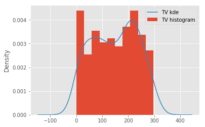
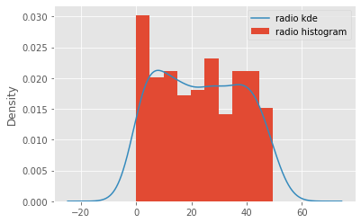
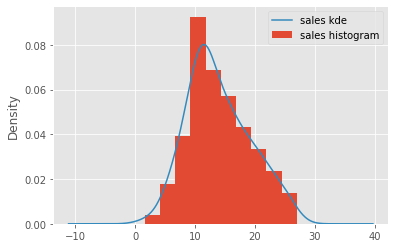
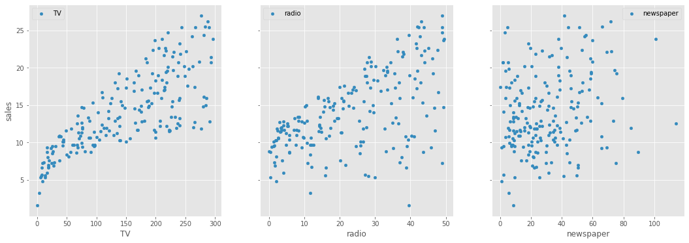
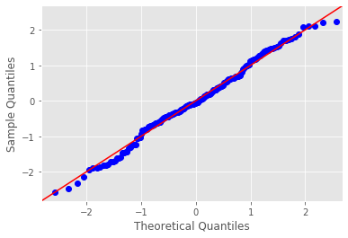
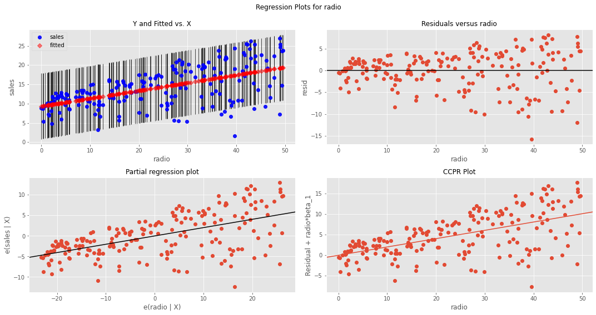
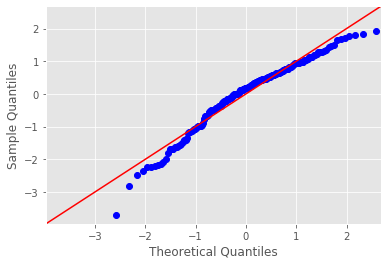

# Ordinary Least Squares in Statsmodels (OLS) - Lab

## Introduction

Previously, you looked at all the requirements for running an OLS simple linear regression using Statsmodels. You worked with the height-weight data set to understand the process and all of the necessary steps that must be performed. In this lab , you'll explore a slightly more complex example to study the impact of spending on different advertising channels on total sales.

## Objectives

You will be able to:
* Perform a linear regression using statsmodels
* Evaluate a linear regression model by using statistical performance metrics pertaining to overall model and specific parameters
* Determine if a particular set of data exhibits the assumptions of linear regression

## Let's get started

In this lab, you'll work with the "Advertising Dataset", which is a very popular dataset for studying simple regression. [The dataset is available on Kaggle](https://www.kaggle.com/purbar/advertising-data), but we have downloaded it for you. It is available in this repository as `advertising.csv`. You'll use this dataset to answer this question:

> Which advertising channel has the strongest relationship with sales volume, and can be used to model and predict the sales?

## Step 1: Read the dataset and inspect its columns and 5-point statistics


```python
# Load necessary libraries and import the data
import pandas as pd
import matplotlib.pyplot as plt
plt.style.use('ggplot')
data = pd.read_csv('Advertising.csv', index_col=0)
```


```python
# Check the columns and first few rows
data.head()
```


<div>
<style scoped>
    .dataframe tbody tr th:only-of-type {
        vertical-align: middle;
    }

    .dataframe tbody tr th {
        vertical-align: top;
    }

    .dataframe thead th {
        text-align: right;
    }
</style>
<table border="1" class="dataframe">
  <thead>
    <tr style="text-align: right;">
      <th></th>
      <th>TV</th>
      <th>radio</th>
      <th>newspaper</th>
      <th>sales</th>
    </tr>
  </thead>
  <tbody>
    <tr>
      <td>1</td>
      <td>230.1</td>
      <td>37.8</td>
      <td>69.2</td>
      <td>22.1</td>
    </tr>
    <tr>
      <td>2</td>
      <td>44.5</td>
      <td>39.3</td>
      <td>45.1</td>
      <td>10.4</td>
    </tr>
    <tr>
      <td>3</td>
      <td>17.2</td>
      <td>45.9</td>
      <td>69.3</td>
      <td>9.3</td>
    </tr>
    <tr>
      <td>4</td>
      <td>151.5</td>
      <td>41.3</td>
      <td>58.5</td>
      <td>18.5</td>
    </tr>
    <tr>
      <td>5</td>
      <td>180.8</td>
      <td>10.8</td>
      <td>58.4</td>
      <td>12.9</td>
    </tr>
  </tbody>
</table>
</div>


```python
# Get the 5-point statistics for data 
data.describe()
```


<div>
<style scoped>
    .dataframe tbody tr th:only-of-type {
        vertical-align: middle;
    }

    .dataframe tbody tr th {
        vertical-align: top;
    }

    .dataframe thead th {
        text-align: right;
    }
</style>
<table border="1" class="dataframe">
  <thead>
    <tr style="text-align: right;">
      <th></th>
      <th>TV</th>
      <th>radio</th>
      <th>newspaper</th>
      <th>sales</th>
    </tr>
  </thead>
  <tbody>
    <tr>
      <td>count</td>
      <td>200.000000</td>
      <td>200.000000</td>
      <td>200.000000</td>
      <td>200.000000</td>
    </tr>
    <tr>
      <td>mean</td>
      <td>147.042500</td>
      <td>23.264000</td>
      <td>30.554000</td>
      <td>14.022500</td>
    </tr>
    <tr>
      <td>std</td>
      <td>85.854236</td>
      <td>14.846809</td>
      <td>21.778621</td>
      <td>5.217457</td>
    </tr>
    <tr>
      <td>min</td>
      <td>0.700000</td>
      <td>0.000000</td>
      <td>0.300000</td>
      <td>1.600000</td>
    </tr>
    <tr>
      <td>25%</td>
      <td>74.375000</td>
      <td>9.975000</td>
      <td>12.750000</td>
      <td>10.375000</td>
    </tr>
    <tr>
      <td>50%</td>
      <td>149.750000</td>
      <td>22.900000</td>
      <td>25.750000</td>
      <td>12.900000</td>
    </tr>
    <tr>
      <td>75%</td>
      <td>218.825000</td>
      <td>36.525000</td>
      <td>45.100000</td>
      <td>17.400000</td>
    </tr>
    <tr>
      <td>max</td>
      <td>296.400000</td>
      <td>49.600000</td>
      <td>114.000000</td>
      <td>27.000000</td>
    </tr>
  </tbody>
</table>
</div>


```python
# Describe the contents of this dataset

# In every record, we have three predictors showing the advertising budget spent on TV, newspaper 
# and radio and a target variable (sales). The target variable shows the sales figure for each marketing 
# campaign along with money spent on all three channels. 
# Looking at means for predictors, most of the budget is spent on TV marketing, and the least is spent on radio.
```

## Step 2: Plot histograms with kde overlay to check the distribution of the predictors


```python
# For all the variables, check distribution by creating a histogram with kde
for column in data:
    data[column].plot.hist(density=True, label = column+' histogram')
    data[column].plot.kde(label =column+' kde')
    plt.legend()
    plt.show()
```











```python
# Record your observations here 

# No variable is "perfectly" normal, but these do tend to follow an overall normal pattern. 
# We see major skew in the newspaper predictor which could be problematic towards analysis. 
# TV and radio are still pretty symmetrical distributions and can be used as predictors
# The target variable "sales" is normally distributed with just a gentle skew
```


## Step 3: Test for the linearity assumption 

Use scatterplots to plot each predictor against the target variable


```python
# visualize the relationship between the preditors and the target using scatterplots
fig, axs = plt.subplots(1, 3, sharey=True, figsize=(18, 6))
for idx, channel in enumerate(['TV', 'radio', 'newspaper']):
    data.plot(kind='scatter', x=channel, y='sales', ax=axs[idx], label=channel)
plt.legend()
plt.show()
```





```python
# Record yor observations on linearity here 

# TV seems to be a good feature due to highly linear relationship with sales
# radio shows a linear pattern as well but there a higher level of variance in there than TV
# newspaper is worse, there is too much variance along the y-axis and there's no clear linear relationship 
# between newspaper and sales.
```

### Conclusion so far

Based on above initial checks, we can confidently say that TV and radio appear to be good predictors for our regression analysis. Newspaper is very heavily skewed and also doesnt show any clear linear relationship with the target. 
> We'll move ahead with our analysis using TV and radio, and rule out newspaper because we believe it violates OLS assumptions

Note: Kurtosis can be dealt with using techniques like log normalization to "push" the peak towards the center of distribution. You'll learn about this later on.

## Step 4: Run a simple regression in Statsmodels with TV as a predictor


```python
# import libraries
import statsmodels.api as sm
import statsmodels.formula.api as smf

# build the formula 
f = 'sales~TV'
# create a fitted model in one line
model = smf.ols(formula=f, data=data).fit()
```

## Step 5: Get Regression Diagnostics Summary


```python
model.summary()
```


<table class="simpletable">
<caption>OLS Regression Results</caption>
<tr>
  <th>Dep. Variable:</th>          <td>sales</td>      <th>  R-squared:         </th> <td>   0.612</td>
</tr>
<tr>
  <th>Model:</th>                   <td>OLS</td>       <th>  Adj. R-squared:    </th> <td>   0.610</td>
</tr>
<tr>
  <th>Method:</th>             <td>Least Squares</td>  <th>  F-statistic:       </th> <td>   312.1</td>
</tr>
<tr>
  <th>Date:</th>             <td>Wed, 21 Oct 2020</td> <th>  Prob (F-statistic):</th> <td>1.47e-42</td>
</tr>
<tr>
  <th>Time:</th>                 <td>15:14:48</td>     <th>  Log-Likelihood:    </th> <td> -519.05</td>
</tr>
<tr>
  <th>No. Observations:</th>      <td>   200</td>      <th>  AIC:               </th> <td>   1042.</td>
</tr>
<tr>
  <th>Df Residuals:</th>          <td>   198</td>      <th>  BIC:               </th> <td>   1049.</td>
</tr>
<tr>
  <th>Df Model:</th>              <td>     1</td>      <th>                     </th>     <td> </td>   
</tr>
<tr>
  <th>Covariance Type:</th>      <td>nonrobust</td>    <th>                     </th>     <td> </td>   
</tr>
</table>
<table class="simpletable">
<tr>
      <td></td>         <th>coef</th>     <th>std err</th>      <th>t</th>      <th>P>|t|</th>  <th>[0.025</th>    <th>0.975]</th>  
</tr>
<tr>
  <th>Intercept</th> <td>    7.0326</td> <td>    0.458</td> <td>   15.360</td> <td> 0.000</td> <td>    6.130</td> <td>    7.935</td>
</tr>
<tr>
  <th>TV</th>        <td>    0.0475</td> <td>    0.003</td> <td>   17.668</td> <td> 0.000</td> <td>    0.042</td> <td>    0.053</td>
</tr>
</table>
<table class="simpletable">
<tr>
  <th>Omnibus:</th>       <td> 0.531</td> <th>  Durbin-Watson:     </th> <td>   1.935</td>
</tr>
<tr>
  <th>Prob(Omnibus):</th> <td> 0.767</td> <th>  Jarque-Bera (JB):  </th> <td>   0.669</td>
</tr>
<tr>
  <th>Skew:</th>          <td>-0.089</td> <th>  Prob(JB):          </th> <td>   0.716</td>
</tr>
<tr>
  <th>Kurtosis:</th>      <td> 2.779</td> <th>  Cond. No.          </th> <td>    338.</td>
</tr>
</table><br/><br/>Warnings:<br/>[1] Standard Errors assume that the covariance matrix of the errors is correctly specified.


```python
# Record your observations on "Goodness of fit" here

# The R-squared value is 0.61 i.e. 61% of the variance in the target variable can be explained by TV spending. 
# The Intercept: A "unit" increase in TV spending is associated with a 0.0475 "unit" 
# increase in Sales or an additional 1,000 spent on TV is associated with an increase in sales of 47.5 
```

Note here that the coefficients represent associations, not causations

## Step 6:  Draw a prediction line with data points on a scatter plot for X (TV) and Y (Sales)

Hint: You can use the `model.predict()` function to predict the start and end point of of regression line for the minimum and maximum values in the 'TV' variable. 


```python
# create a DataFrame with the minimum and maximum values of TV
X_new = pd.DataFrame({'TV': [data.TV.min(), data.TV.max()]})
print(X_new.head())

# make predictions for those x values and store them
preds = model.predict(X_new)
print (preds)

# first, plot the observed data and the least squares line
data.plot(kind='scatter', x='TV', y='sales')
plt.plot(X_new, preds, c='red', linewidth=2)
plt.show()
```

          TV
    0    0.7
    1  296.4
    0     7.065869
    1    21.122454
    dtype: float64


## Step 7: Visualize the error term for variance and heteroscedasticity


```python
fig = plt.figure(figsize=(15,8))
fig = sm.graphics.plot_regress_exog(model, "TV", fig=fig)
plt.show()
```


```python
# Record Your observations on heteroscedasticity

# From the first and second plot in the first row, we see a cone-shape which is a sign of heteroscedasticity. 
# i.e. the residuals are heteroscedastic. This violates an assumption.
```

## Step 8: Check the normality assumptions by creating a QQ-plot


```python
import scipy.stats as stats
residuals = model.resid
fig = sm.graphics.qqplot(residuals, dist=stats.norm, line='45', fit=True)
fig.show()
```

    /Users/jeffrey.hinkle@wework.com/opt/anaconda3/envs/learn-env/lib/python3.6/site-packages/ipykernel_launcher.py:5: UserWarning: Matplotlib is currently using module://ipykernel.pylab.backend_inline, which is a non-GUI backend, so cannot show the figure.
      """





```python
# Record Your observations on the normality assumption

# With a pretty good QQ plot the normality assumption of the residuals seems fulfilled.
```

## Step 9: Repeat the above for radio and record your observations


```python
f = 'sales~radio'
model = smf.ols(formula=f, data=data).fit()
print ('R-Squared:',model.rsquared)
print (model.params)
X_new = pd.DataFrame({'radio': [data.radio.min(), data.radio.max()]});
preds = model.predict(X_new)
data.plot(kind='scatter', x='radio', y='sales');
plt.plot(X_new, preds, c='red', linewidth=2);
plt.show()
fig = plt.figure(figsize=(15,8))
fig = sm.graphics.plot_regress_exog(model, "radio", fig=fig)
plt.show()
import scipy.stats as stats
residuals = model.resid
fig = sm.graphics.qqplot(residuals, dist=stats.norm, line='45', fit=True)
fig.show()
```

    R-Squared: 0.33203245544529525
    Intercept    9.311638
    radio        0.202496
    dtype: float64





    /Users/jeffrey.hinkle@wework.com/opt/anaconda3/envs/learn-env/lib/python3.6/site-packages/ipykernel_launcher.py:17: UserWarning: Matplotlib is currently using module://ipykernel.pylab.backend_inline, which is a non-GUI backend, so cannot show the figure.





```python
model.summary()
```


<table class="simpletable">
<caption>OLS Regression Results</caption>
<tr>
  <th>Dep. Variable:</th>          <td>sales</td>      <th>  R-squared:         </th> <td>   0.332</td>
</tr>
<tr>
  <th>Model:</th>                   <td>OLS</td>       <th>  Adj. R-squared:    </th> <td>   0.329</td>
</tr>
<tr>
  <th>Method:</th>             <td>Least Squares</td>  <th>  F-statistic:       </th> <td>   98.42</td>
</tr>
<tr>
  <th>Date:</th>             <td>Wed, 21 Oct 2020</td> <th>  Prob (F-statistic):</th> <td>4.35e-19</td>
</tr>
<tr>
  <th>Time:</th>                 <td>15:15:39</td>     <th>  Log-Likelihood:    </th> <td> -573.34</td>
</tr>
<tr>
  <th>No. Observations:</th>      <td>   200</td>      <th>  AIC:               </th> <td>   1151.</td>
</tr>
<tr>
  <th>Df Residuals:</th>          <td>   198</td>      <th>  BIC:               </th> <td>   1157.</td>
</tr>
<tr>
  <th>Df Model:</th>              <td>     1</td>      <th>                     </th>     <td> </td>   
</tr>
<tr>
  <th>Covariance Type:</th>      <td>nonrobust</td>    <th>                     </th>     <td> </td>   
</tr>
</table>
<table class="simpletable">
<tr>
      <td></td>         <th>coef</th>     <th>std err</th>      <th>t</th>      <th>P>|t|</th>  <th>[0.025</th>    <th>0.975]</th>  
</tr>
<tr>
  <th>Intercept</th> <td>    9.3116</td> <td>    0.563</td> <td>   16.542</td> <td> 0.000</td> <td>    8.202</td> <td>   10.422</td>
</tr>
<tr>
  <th>radio</th>     <td>    0.2025</td> <td>    0.020</td> <td>    9.921</td> <td> 0.000</td> <td>    0.162</td> <td>    0.243</td>
</tr>
</table>
<table class="simpletable">
<tr>
  <th>Omnibus:</th>       <td>19.358</td> <th>  Durbin-Watson:     </th> <td>   1.946</td>
</tr>
<tr>
  <th>Prob(Omnibus):</th> <td> 0.000</td> <th>  Jarque-Bera (JB):  </th> <td>  21.910</td>
</tr>
<tr>
  <th>Skew:</th>          <td>-0.764</td> <th>  Prob(JB):          </th> <td>1.75e-05</td>
</tr>
<tr>
  <th>Kurtosis:</th>      <td> 3.544</td> <th>  Cond. No.          </th> <td>    51.4</td>
</tr>
</table><br/><br/>Warnings:<br/>[1] Standard Errors assume that the covariance matrix of the errors is correctly specified.


```python
# Record your observations here for goodnes of fit 


# As a predictor, radio performs worse than TV. 
# It has higher amount of skewness and kurtosis than TV. After running the model, it also became clear that 
# the residuals QQ plot looks off, so the normality assumption is not fulfilled.
# A very low R_squared explaining only 33% of variance in the target variable.

# A "unit" increase in radio spending is associated with a 0.2025 "unit" increase in Sales.
# OR An additional 1,000 spent on TV is associated with an increase in sales of 202.5

# There is obvious heteroscedasticity as with the case of TV.
```

## The Answer

Based on the above analysis, you can conclude that none of the two chosen predictors is ideal for modeling a relationship with the sales volumes. `Newspaper` clearly violated the linearity assumption. `TV` and `radio` did not provide a high value for the coefficient of determination, where TV performed slightly better than the radio. There is obvious heteroscdasticity in the residuals for both variables. 

> We can either look for further data, perform extra preprocessing or use more advanced techniques. 

Remember there are lots of techniques we can employ to fix these data. 

Whether we should call TV the "best predictor" or label all of them "equally useless", is a domain specific question and a marketing manager would have a better opinion on how to move forward with this situation. 

In the following lesson, you'll look at the more details on interpreting the regression diagnostics and confidence in the model. 

## Summary

In this lab, you ran a complete regression analysis with a simple dataset. You used statsmodel to perform linear regression and evaluated your models using statistical metrics. You also looked for the regression assumptions before and after the analysis phase. Finally, you created some visualizations of your models and checked their goodness of fit. 
